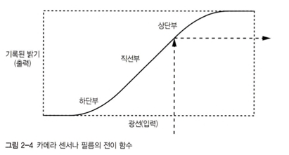
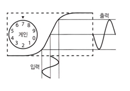
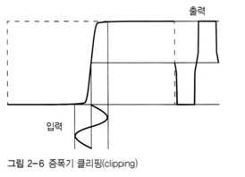

# 2장 전자 회로의 조합 논리

비트는 오늘날 사용되는 기술에 어울림

### 아날로그와 디지털 차이

- 아날로그: 연속적
- 디지털: 이산적

### 하드웨어에서 크기가 중요한 이유

- 컴퓨터는 전자를 이용해 계산
- 물리적인 한계를 뛰어넘기 위해 부품을 가능한 가깝게 위치(거리 감소, 필요하 에너지 양 감소, 전력소모와 열 발생 감소)
- 역사적으로 하드웨어를 작게 만들려고 했던 이유

### 디지털을 사용하면 더 안정적인 장치를 만들 수 있음

- 하드웨어를 작게 만들수록 외부와 내부에서 오는 간섭으로 인해 정확한 측정은 어려움
- 판정기준을 도입하면 값 중에 어떤 범위의 값을 표현할 수 있는 가능성이 사라짐(반올림처럼)
- 판정기준을 도입해 생기는 '안정성'이 우리가 디지털 컴퓨터를 만드는 이유

### 아날로그 세계에서 디지털 만들기

- 전이함수('실제 세계의 현상'에 대한 입력값에 대한 출력값을 표현하는 함수)
- 아날로그는 가능한 선형 영역을 크게 만들기 위해 노력하는 것
- 디지털은 직선부를 가능하면 작게 만드는 것(왜곡 이용해서 연속적인 공간을 이산적으로 만들 수 있음)

- 이때 판정 기준을 문턱값(threshold)라고함

### 십진 숫자 대신 비트를 사용하는 이유

- 비트를 사용하면 100배 이상 효율이 더 좋아짐(BCD보다 2진수가 더 좋은 것처럼)
- 숫자를 사용하면 전이 함수를 각기 다른 10가지 문턱값으로 구분할 간단한 방법이 없음(문턱값 10개나 만들어야 함)

## 간단한 전기 이론 가이드

### 전기는 수도 배관과 유사함

- 직렬 연결은 AND 연산
- 병렬 연결은 OR 연산

### 전기 스위치

- 전기 시스템은 회로(건물의 배관 시스템에 해당)
- 스위치는 마치 도개교, 나이프 스위치
- 회로 - 에너지 근원에서 나온 전기는 구성요소를 지나 다시 근원으로 돌아감
- 극(pole)은 스위치, 투(throw)는 스위치가 닿을 접점
    - 단극 단투 스위치는 하나의 스위치로 접점에 닿거나 닿지 않게 할 수 있음

## 비트를 처리하기 위한 하드웨어

### 릴레이

- 스위치를 움직이기 위해 전자석을 사용하는 장치
- 릴레이를 이용해 AND, OR 함수 구현 가능
    - 릴레이 하나는 NOT 함수
    - 릴레이 직렬 연결은 AND 함수
    - 릴레이 병렬 연결은 OR 함수
- 릴레이에서 문턱값은 수직(전이 함수 값이 정의 되지 않음)
- 느리고 전기 많이 소모
- 먼지나 벌레 많이 낌 -> 버그의 유래

### 진공관

- 열전자 방출 현상(열을 충분히 가하면 전자가 튀어나옴) 이용
- 캐소드에 열을 가하면 전자가 애노드로 날아가고 그리드가 그것을 막기도 함(삼극관)
- 릴레이보다 훨씬 빠름
- but, 전구처럼 아주 뜨겁고 깨지기 쉬움. 히터가 타버릴 수도 있음.

### 트랜지스터(TR)

- 반도체라는 물질 사용
- 반도체 물질로 이뤄진 기판 또는 슬랩 위에 만들어짐
- 실리콘 위에 광식각
- BJT(Bipolar Junction Transistor, 쌍극 접합 트랜지스터)
    - p형 반도체와 n형 반도체를 샌드위치 형태로 접합
    - NPN 트랜지스터(컬렉터->베이스->이미터), PNP 트랜지스터(이미터->베이스->컬렉터)
    - 베이스가 스위치 손잡이
- FET(Field Effect Transistor, 필드 효과 트랜지스터)
    - 정전기 사용
    - MOSFET(Metal-Oxide Semiconductor Field Effect Transistor, 금속 산화물 반도체 전계 효과 트랜지스터)를 이용
    - N채널 MOSFET(드레인->게이트->소스), P채널 MOSFET(소스->게이트->드레인)
    - 베이스가 스위치 손잡이

### 집적 회로

- 복잡한 시스템을 트랜지스터 하나를 만드는 정도의 비용으로 만들 수 있음
- 칩이라고도 불림

## 논리 게이트

- 칩 안에는 논리 게이트가 들어 있음
- AND 게이트, OR 게이트, XOR 게이트, 인버터 (각각 AND, OR, XOR, NOT 연산 수행)
- 논리 게이트에서 가장 단순한 회로는 NAND, NOR
    - AND, OR은 NAND, NOR 회로 출력을 트랜지스터를 이용해 반전시켜야 함(비싸고 반응 속도 느림)
- 여러 게이트 조합해서 쉽게 복잡한 회로 구성 가능

### 이력 현상을 활용한 '잡음 내성' 향상

- 디지털 장치 사용하면 판정 기준에 의한 잡음 내성을 얻을 수 있음
- 실제 현실에서는 신호가 1에서 0으로 순간적으로 바뀌지 않고 천천히 바뀜
- 신호가 문턱값을 여러번 오락가락 하는 글리치를 이력 현상을 사용해 방지 가능
- 이력 현상(hysteresis) - 판정 기준이 과거에 벌어진 일에 따라 달라진다는 뜻
    - 출력이 0이면 오른쪽 곡선 사용, 1이면 반대
    - 올라가는 신호와 내려가는 신호에 각기 다른 문턱값 생김 -> 출력이 반전되려면 값이 많이 더 변해야 함(잡음 내성)
- 슈미트 트리거라는 게이트에서 사용

### 차동 신호

- 차동 신호 이용하여 강력한 잡음 내성
- 서로 반전관계인 신호 쌍의 차이를 측정함
- but, 너무 잡음이 많으면 정격 작동 범위 초과할 수 있음
- twisted-par cabling은 잡음을 방지해줌

### 전파 지연

- 최대 지연값과 최소 지연값을 감안해 설계를 수행해야 함
- 전파 지연으로 인해 출력을 신뢰 할 수 없는 구간이 존재
- 여러 게이트를 엮으면 전파 지연 더 길어짐
- 현대적인 부품에서 게이트 지연은 매우 짧음
-

## 출력 유형

- 토템폴 출력: 일반적인 게이트 출력. 트랜지스터가 세로로 나란이 늘어서 있음
- 오픈 컬렉터/오픈 드레인 출력: 원하는 출력이 0이면 출력은 0, 1이면 출력값을 알 수 없음
- 트라이스테이트 출력: 상태가 세 가지(0, 1, hi-Z)인 출력. 출력을 켜고 끄기 위한 활성화 입력이 존재.

## 게이트를 조합한 복잡한 회로

- 게이트 조합하여 SSI, MSI, LSI, VLSI 만듦

### 가산기

- 2의 보수 가산기 - XOR과 AND 연산으로 게이트 만들기
    - 두 비트를 계산 하기 위한 반가산기(XOR 게이트와 AND 게이트로 구성)
    - 올림 처리가 필요할 때는 올림 입력을 받는 전 가산기 필요
    - 리플 자리올림 가산기: 여러 비트를 더하는 가산기. 비트 처리 시마다 게이트 2게에 해당하는 출력 시간 지연 발생
    - 올림 예측 가산기를 사용하면 지연 줄일 수 있음
- 계산 속도와 전력소모 사이에는 트레이드 오프관계가 존재

### 디코더

- 인코딩된 수를 개별 비트의 집합으로 만들어줌

### 디멀티플렉서(디먹스) -> 분기 처리

- 디코더를 사용해 디멀티플렉서 만드는 것 가능
- 입력을 몇 가지 출력 중 한 곳으로 전달

### 셀렉터(멀티플렉서, 먹스) -> 선택

- 게이트를 사용해 셀렉터 만드는 것 가능
- 여러 입력 중 하나를 선택