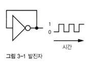

# 3장 메모리와 디스크의 핵심: 순차 논리

순차 논리: 시간적으로 어떤 값 뒤에 오른 다른 값인 순서

디지털 회로는 수를 다를 수 있지만 시간을 다루려면 시간을 어떻게든 만들어 내야 함

조합 논리는 현재 상태만 다룸 but, 순차 논리는 현재와 과거 생태를 함께 고려

## 시간 표현과 상태 기억

주기 함수를 통해 시간 측정 가능

컴퓨터는 주기적인 전기 신호 이용

### 발진자(Oscillator)

되먹임(인버터의 입력과 출력의 반복)을 이용한 출력의 진동을 이용해 시간 측정 가능
더 안정적인 주파수로 진동하는 발진자, 크리스털(압전 효과 이용. 석영이 대표적)를 통해서 더 정확한 측정 가능

### 클록

컴퓨터는 정확한 시간이 필요함

발진자가 컴퓨터에 클록(시간을 셀 수 있게 해주는 신호)을 제공해좀

## 래치

OR 게이트는 되먹임을 통해 1비트를 기억할 수 있음

한번 1이 들어오면 1이 출력됨. 그 뒤에는 0이 들어와도 계속 1이 출력됨 -> 과거 상태 기억

다시 0으로 만드려면 되먹임을 끊고 재설정할 방법이 필요

- AND-OR 게이트 래치
- S-R 래치

### 게이트가 있는 래치

무언가 기억한다는 것의 의미 - 게이트가 열려 있는 동한 스스로의 상태를 바꾸지 않기(게이트가 있는 D 래치에서)

### 플립플롭

- 에지: 논리 수준이 한 수준에서 다른 수준으로 전이
- 플립플롭: 에지에 의해 데이터 변화가 촉될되는 래치

플립플롭의 상태가 바뀌어도 시스템에 아무 영향도 끼치지 못함

### 카운터

디지털 시계 - 발진자에서 나온 시간을 세고, 그 값을 디코더에 공급해서 숫자를 표시하는 디스플레이 제어

- 리플 카운터 - 개수를 센 결과가 약간의 시차를 두고 왼쪽에서 오른쪽으로 퍼져나감(비동기 카운터)
- 비동기적 카운터는 전파 지연 허용보다 더 빠른 속도로 입력이 변화되면서 출력 틀리는 경우 생김
- 동기적 카운터를 통해 비동기 카운터 타이밍 문제 해결
- 카운터를 이용해서 시간을 셀 수 있음

### 레지스터

- 레지스터: 값을 기억하기 위해 D 플립플롭을 한 패키니에 넣음

## 메모리 조직과 주소 지정

- 여러가지 비트를 저장하기 위해 레지스터에 번호 부여 -> 주소(address) 개념
- 각 레지스터 출력을 위해 셀렉터 사용
- 버스: 주소와 데이터 간의 연관된 신호. 비트를 이동 시키는 대량 교통 수단.
- 메모리 크기가 늘어나면 주소로 연결해야 할 비트 수도 많아짐
    - 행과 열로 나눔 - 열 주소 디코더, 행 주소 디코다
    - 행과 열 주소를 멀티플렉싱하면 주소 라인의 수를 반으로 줄일 수 있음
    - 메모리 칩의 '깊이 x 너비' 표시는 칩의 메모리 지점 수를 나타냄

### 임의 접근 메모리(RAM)

- SRAM: 비싸지만 아주 빠름
- DRAM
    - 커패시터라는 버킷에 전자를 담고 트랜지스터를 1개만 사용에 덮음
    - 주기적인 갱신 필요
    - 집적도가 높아 큰 메모리 칩에 사용됨
    - 메모리가 크다는 것은 주소가 더 많다는 뜻(주소 멀티플렉싱 사용)
    - 행(페이지) 주소 저장이 열 주소 저장보다 빠름
- SRAM, DRAM은 둘다 휘발성 메모리
- 코어 메모리는 비트를 토러스 모양의 쇳조각에 저장
    - 가로세로선이 통과하는 격자에 코어가 배열된 평면으로 배열(3차원)
    - 코어 에 담긴 정보를 읽기 위해 감지선 존재

### 읽기 전용 메모리(ROM)

- 한 번만 쓸수 있는 메모리가 더 적합한 이름
- 홀러리스 카드(천공 카드)
- IBM 카드 리더 -> 순차적
- 천공 종이 테이프 -> 순차적
- 마스크 프로그래머블 롬(mask-PROM)
- 프로그래머블 롬(PROM)
    - 니크롬 퓨즈
- 지울 수 있는 읽기 전용 메모리(EPROM)
    - 자외선 이용
- 전기로 지울 수 있는 읽기 전용 메모리(EEPROM)
    - 지울 수 있지만 그 속도는 느림

## 블록 장치

- 디스크 드라이브
    - 자화된 플래터에 비트 저장
    - 디스크 헤드가 읽어들임
    - 속도는 느림
- 자기테이프
- 광학디스크
    - CD, DVD 등

## 플래시 메모리와 SSD

- 플래시 메모리: DRAM처럼 버킷에 전자를 담는 방식
    - but, DRAM의 버킷보다 더 크고 잘 만들어 져있어 전자가 새지 않음
    - 여러 번 읽고 쓰면 뚜껑의 경첩이 닳아서 끊어져 버림
    - 임의 접근(읽기 시), 블록 접근(쓰기 시) 장치
- SSD: 디스크 드라이브 모양 패키지에 넣은 플래시 메모리와 같음

## 오류 감지와 정정

- 패리티
    - 짝수(모든 비트 서로 XOR 연산), 홀수(XOR 연산한 값의 보수) 패리티
- 해밍코드
- 체크섬
- CRC

## 하드웨어와 소프트웨어 비교

- 소프트웨어가 설계에 들어가는 시간 제외하고는 추가 비용 없기 때문에 하드웨어보다 만들기 쉬움
- 펌웨어 - ROM에 담긴 소프트웨어
- 집적회로나 PROM, EEPROM 등은 제작비용이 많이 듦
- 현대적 FPGA(현장에서 프로그램 가능한 게이트 배열)을 사용하면 소프트웨어 로직을 지우고 다시 프로그래밍 가능
