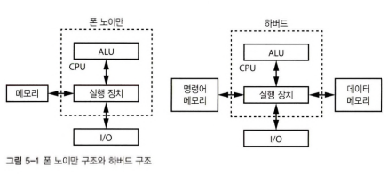

# 5장 컴퓨터 아키텍처와 운영체제

## 기본적인 구조요소들

- 흔한 컴퓨터 구조 -> 폰노이만 구조, 하버드 구조
  
- 메모리 배열 차이: 메모리에서 명령어와 데이터를 동시에 가져올 수 없기에 폰 노이만 구조가 약간 더 느림

### 프로세서 코어

멀티프로세서, 병렬화(여러 CPU 활용)만으로는 성능 높이기 부족, 전력 장벽 문제 -> 멀티 프로세서 코어(CPU 속에 여러 CPU)가 해결책

### 마이크로프로세서와 마이크로 컴퓨터

- 마이크로프로세서: 메모리와 I/O가 프로세서 코어와 같은 패키지에 들있지 않은 경우 -> 큰 시스템에 부품으로 사용
- 마이크로컴퓨터, 마이크로컨트롤러: 모든 요소를 한 칩안에 패키징한 경우 -> 식기세척기 등에 사용되는 작은 컴퓨터
- 단일 칩 시스템(System on Chip, SoC): 더 복잡한 마이크로컴퓨터. I/O 대신 WiFi 회로 등 복잡한 장치 내장.

### 프로시저, 서브루틴, 함수

- 함수(프로시저, 서브루틴) -> 코드를 재사용 하는 주요 수단
- 함수 호출 과정
    1. 반환 주소 저장
    2. 함수 파라미터를 누산기에 저장
    3. 함수로 분기 - 함수 작업 수행
    4. 함수 반환(간접 분기) 뒤에 실행 계속
    5. 반환 주소 반환

## 스택

- 재귀: 함수가 자기 자신 호출
- 재귀 함수가 제대로 도악하려면 반환 주소를 여럿 저장할 수 있어야 함
- 깊이 우선 순회(DFS): 더 이상 아래로 내려 갈 수 없을 때만 옆으로 이동
- 너비 우선 순회(BFS): 옆을 먼저 탐색한후 내려감
- 트리에서 한수준 내려갈 때마다 돌아올 위치를 기억해야 함 -> 스택 필요
- 스택: LIFO 구조
    - 데이터를 push해 넣거나 pop해서 제거할 수 있음
    - 더 이상 push 할 수 없으면 스택 오버플로우 발생
    - 빈 스택에서 물건을 가져오려고 하는 경우는 스택 언더플로우
    - 하드웨어에는 소프트웨어로 스택 오버플로 항상 검사 안해도 되는 한계 레지스터포함
- 스택 프레임: 함수가 호출될 때마다 스택에 저장되는 데이터 모음

## 인터럽트

- 폴링: 조건을 충족할 때까지 계속해서 확인
- 인터럽트: 실행 중인 프로그램을 잠깐 중단 시키기
- 요즘 프로세서 대부분은 인터럽트 시스템(적절한 신호가 들어오면 CPU 실행을 잠깐 중단시킬 수 있는 핀이나 전기 연결) 포함
- 인터럽트 시스템에서 주변 장치들은 인터럽트 요청 생성
- 프로세서가 현재 실행 중인 프로그램을 잠시 중단시키고 인터럽트 핸들러라는 다른 실행 프로그램 실행
- 핸들러가 작업 마치고 나면 원래 실행 중인 프로그램다시 시작
- 응답시간, 현재 상태 저장 방법 고려 필요
- 컴퓨터는 인터럽트 벡터를사용해 핸들러 위치를 찾음
- 인터럽트를 중단할 수 있는 '마스크' 존재
- 인터럽트 간의 우선 순위 있음
- 타이머, 시그널, 이벤트 개념

## 상대 주소 지정

- 시스템 프로그램
    - OS, OS 커널
- 사용자 프로그램(프로세스)
    - 시스템 프로그램 외 프로그램
- 시분할 방식
- 인덱스 레지스터
- 상대 주소 지정
- 주소 재배치

## 메모리 관리 장치

- 백그라운드 실행 위해 오늘날 대부분 마이크로프로세서에 메모리 관리 장치(MMU)존재
- 페이지 테이블
    - 메모리를 페이지로 분할
    - 페이지를 관리하는 RAM의 영역. 이를 통해서 주소를 변환
    - 물리적 메모리에 연관되지 않은 주소에 접근하면 '페이지 폴트' 예외 발생
    - MMU로 인핸 폰 노이만 구조, 하버드 구조 구분이 의미 없어짐

## 가상 메모리

- OS는 MMU를 사용해 사용자 프로그램에 가상 메모리 제공
- 요청 받은 메모리가 사용 가능한 메모리의 크기보다 클 경우 현재 필요하지 않는 페이지를 디스크로 옮김(스왑 아웃)
- 다시 불러들이는 건 '스왑 인'
- 이런식으로 페이징 처리하는 것을 요구불 페이징(demand paging)
- 성능 저하 막기 위한 다양한 기법 존재. 최소 최근 사용(LRU) 등.

## 시스템 공간과 사용자 공간

- CPU에는 시스템 모드에 있는지 사용자 모드에 있는지 결정하는 비트가 레지스터에 들어 있음
- I/O 처리 명령어 등 일부 명령어는 특권 명령어(시스템 모드에서만 실행 가능)
- 트랩이나 시스템 콜을 사용해 시스템 모드 프로그램(운영체제)에 요청 보낼 수 있음
- 사용자 프로그램을 다른 프로그램과 운영체제로부터 보호하고, 운영체제가 자원 할당을 전적으로 제어할 수 있다는 장점

## 메모리 계층과 성능

- CPU의 속도를 따라가지 못하는 메모리 문제를 해결 하기위해 등장한 메모리 계층
- 주 메모리 -> RAM. 프로세서보다 느림
- 캐시 메모리를 추가해서 문제 해결(프로그램이 메모리를 순서대로 읽어오고, 자주 사용하는 데이터가 한데 모여 있는 경우가 많음)
- 메모리 컨트롤러 - 메모리에서 연속된 열에 있는 데이터를 한번에 가져옴
- 캐시 히트, 캐시 미스
- 캐시 메모리도 계층 있음(L1, L2, L3)
- 메모리에서 미리 가져오는 프리 페치, 순서를 벗어나는 실행 처리 등 수정을 통해 성능 향상도 가능

## 코프로세서

- 코프로세서 - 프로세서보다 더 단순한 회로
- 요즘에는 여러 가지 기능을 담당하는 코프로세서를 한 칩안에 같이 넣음
- DMA: 장치에 데이터 복사 등 귀찮은 일 떠맡겨서 CPU가 유용한 연산을 더 많이 처리할 수 있음

## 메모리상의 데이터 배치

- 정적 데이터(얼마나 많은 메모리가 필요한지 알고 있음) -> 스택
- 동적 데이터 -> 힙. 주로 정적 데이터가 차지하는 영역 바로 위 영역에 쌓임.
- 힙과 스택이 충돌하지 않게 하는 것이 중요
- 마이크로컴퓨터에는 MMU가 없어서 스택을 맨 위에, 힙을 그 아래에 배치하는 경우가 많음

## 프로그램 실행

- 라이브러리: 함수를 한 데 모은 것
- 한 프로그램의 여러 부분을 동시에 개발할 수 있으므로 여러 조각으로 나눔 -> 조각들을 하나로 엮거나 연결할 링크 필요
- 정적 링크: 라이브러리를 필요한 함수가 들어있는 파일로 간주해서 프로그램의 나머지 부분과 직접 연결해 실행 파일 만듦
- 동적 링크: 공유 라이브러리를 사용하는 동적 링크를 발명
- 프로그램이 실행될때 가장 먼저 실행되는 명령어는 진입점에 있는 명령어가 아님.
    - 프로그램을 이루는 모든 부분이 하나로 합쳐져서 실행파일을 이룰 때 런타임 라이브러리가 추가되며
    - 이 런타임 라이브러리에 있는 명령어가 실행되고 나서 진입점의 명령어가 실행됨

## 메모리 전력 소비

- 성능뿐만 아니라 전력 소비도 고려해야 함